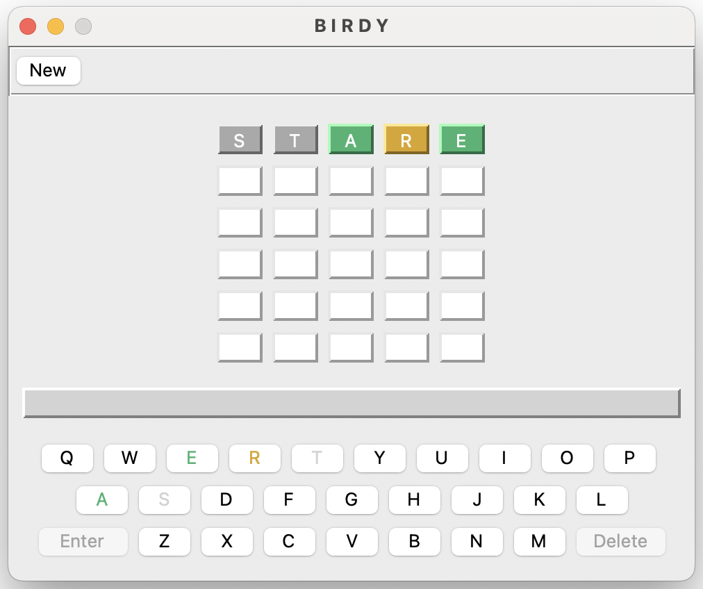
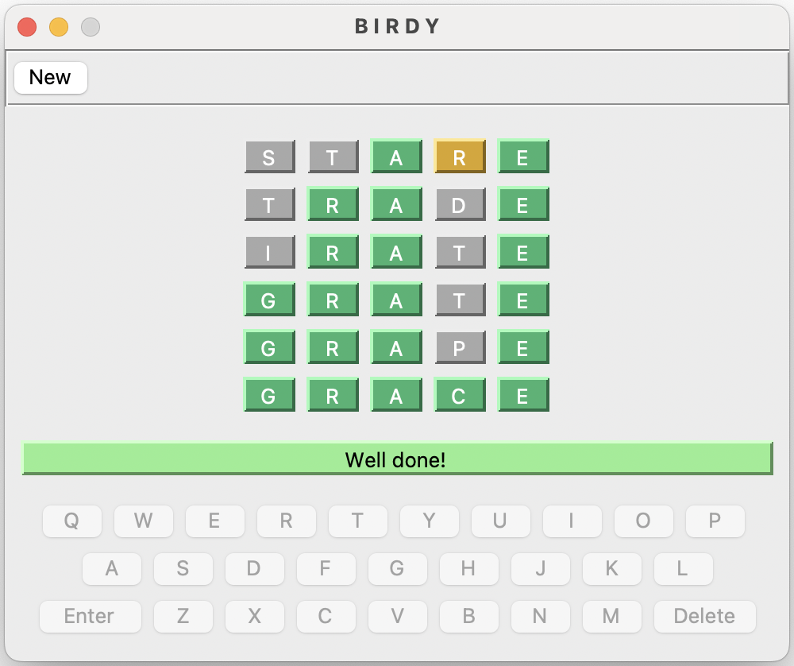
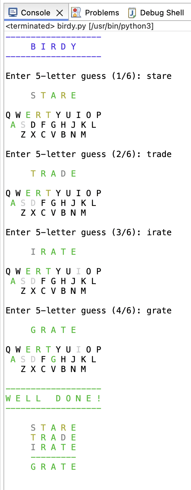

# Birdy
## Instructions
I have a pet birdy, and I named it... a random five letter word. But now I have forgot my birdy's name. It's lost, and I need to call it back!

You have six attempts to remind me of my birdy's name.

It may be played on your desktop in either graphical or text only mode depending which Python module you launch.

Note: Tkinter is required to launch the graphical version: `pip install tk`

### Launch With Python

Graphical: `python -m src.presentation.ui.birdy`

Text Only: `python -m src.presentation.console.birdy`

It may also be launched with the following optional user supplied parameters:

`birdy <chances_allowed> <birdy_name>`

## Screenshots
### Graphical

### Text Only

## Notes
* Developed and tested-only on a 2021 Macbook Pro with an Apple M1 Max chip running Mac OS 14.4.1
* Code was developed in Eclipse version 2024-03 (4.31.0), using the PyDev Plugin version 12
* Python version 3.12.4 was used
* Text Only version uses only libraries contained within the Python version 3.12.4 install
* Graphical version requires Tkinter, and version used for development was Tk version 8.6.14
* Graphical version will accept keystrokes from the graphical keyboard or the user's manual keyboard
* Code has been written to deal with birdy names of any length, however currently we only have a birdy missing with a 5-letter word name
