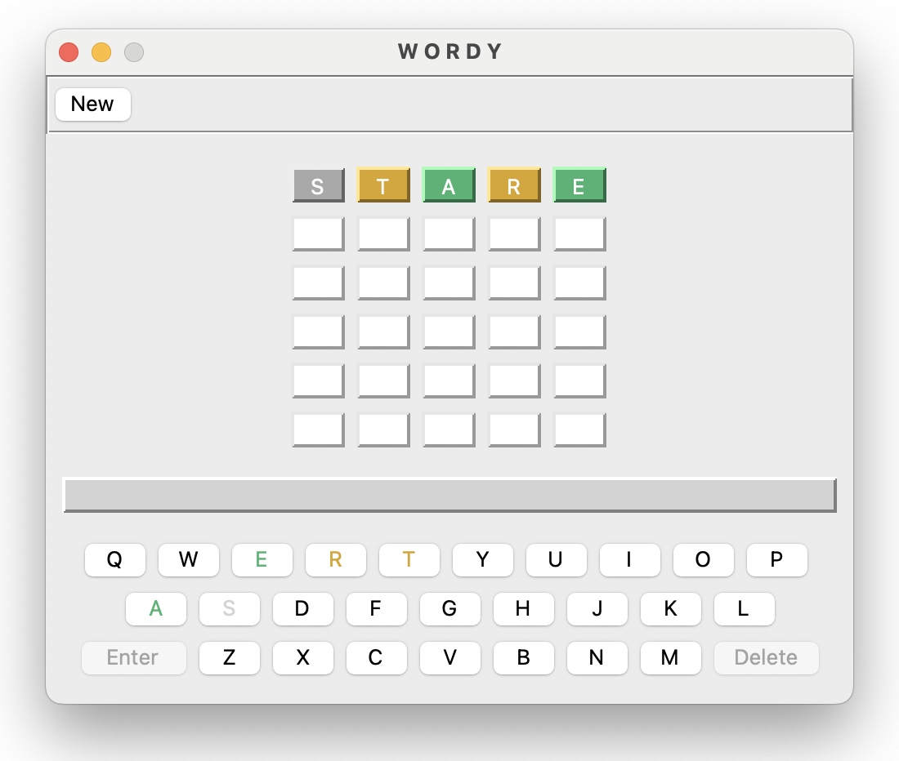
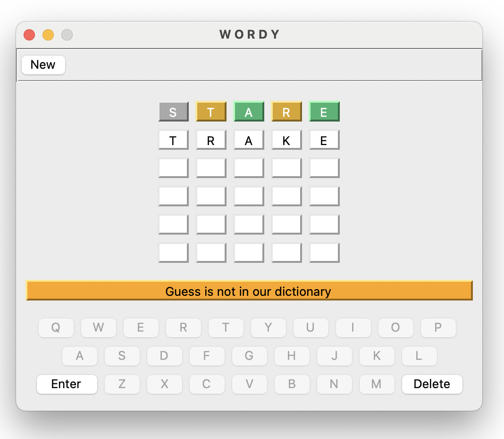
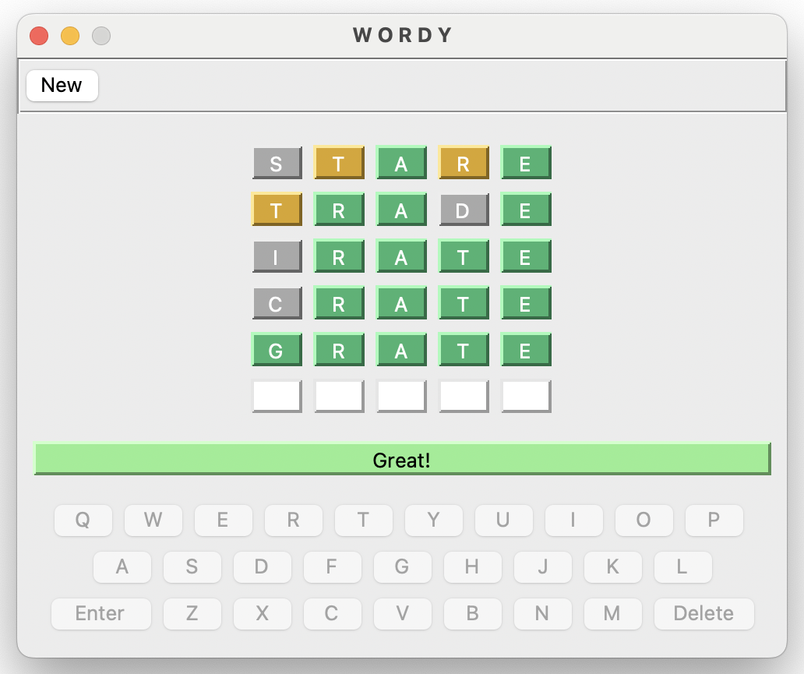

# Wordy
## Instructions
Wordy picks a random 5-letter word, supplied from an internal dictionary, and the user has six attempts to guess the answer.

It may be played in graphical or text only mode.

Graphical: `python3 -m src.presentation.ui.wordy`

Text Only: `python3 -m src.presentation.console.wordy`

It may also be launched with the following optional user supplied parameters:

`wordy <chances_allowed> <answer_string>`

Code has been written to deal with answers of any length, however currently we only include dictionarys for 5-letter words

## Screenshots

## Notes
* Developed and tested-only on a 2021 Macbook Pro with an Apple M1 Max chip running Mac OS 14.4.1
* Code was developed in Eclipse version 2024-03 (4.31.0), using the PyDev Plugin version 12
* Python version 3.12.4 was used
* Text Only version uses only libraries contained within the Python version 3.12.4 install
* Graphical version requires Tkinter, and version used for development was Tk version 8.6.14
* Graphical version will accept keystrokes from with the graphical keyboard or user's manual keyboard
